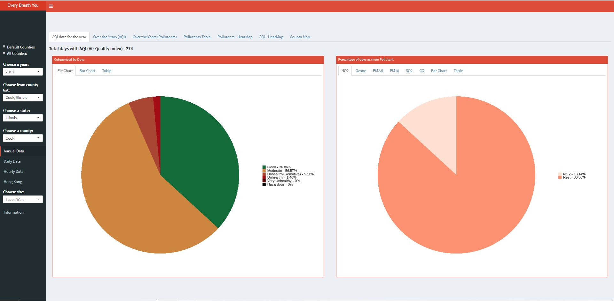
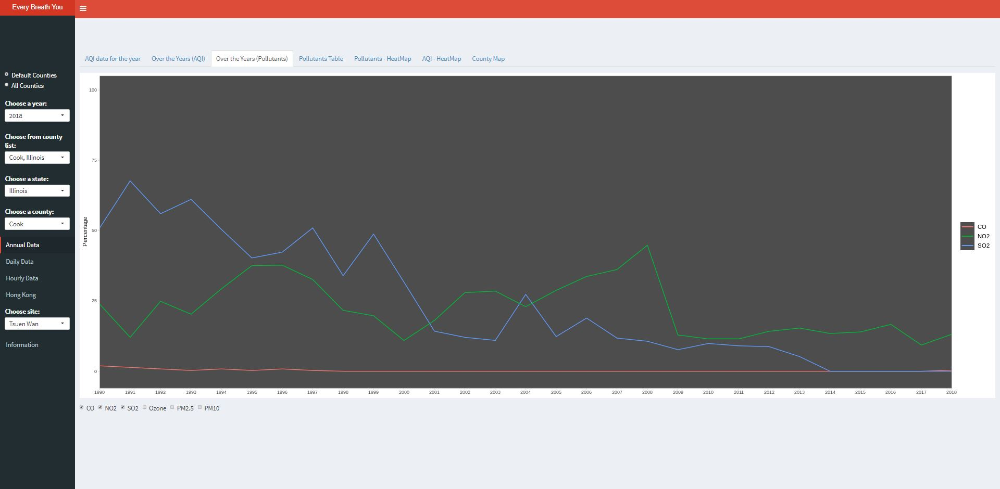
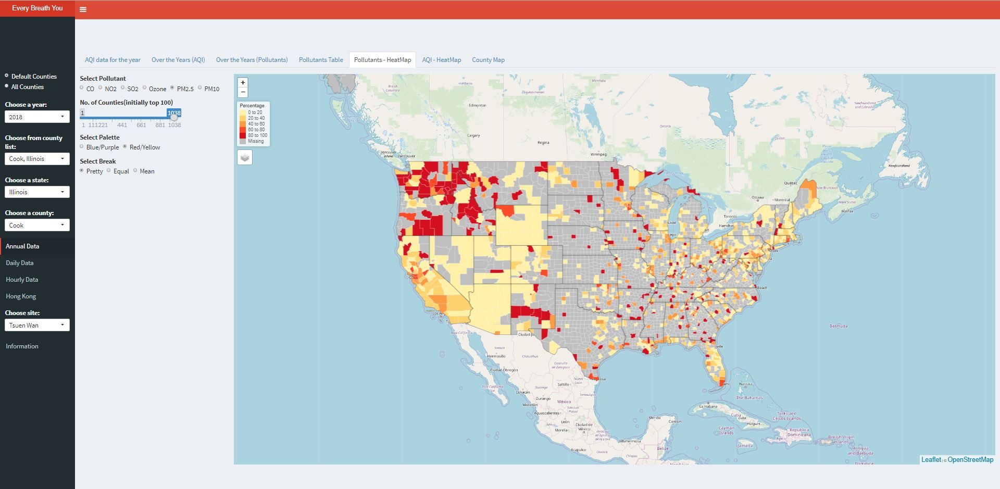
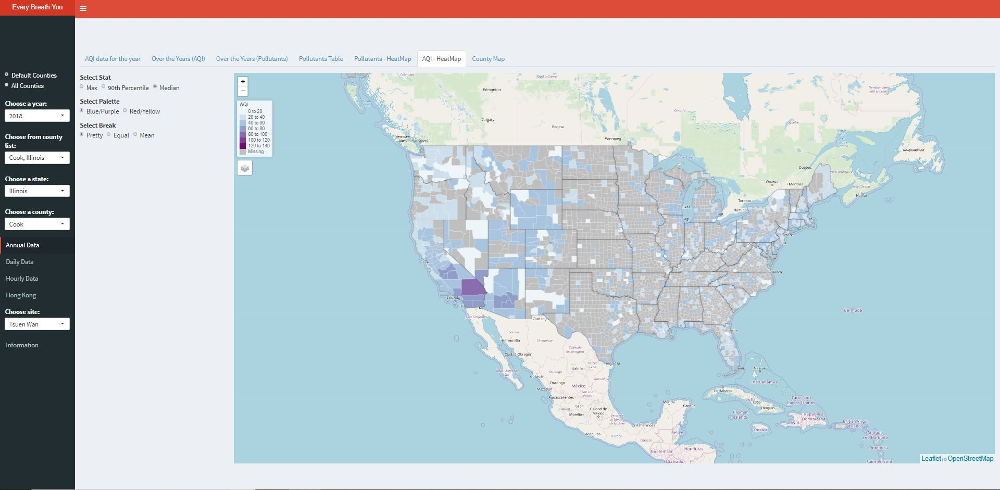
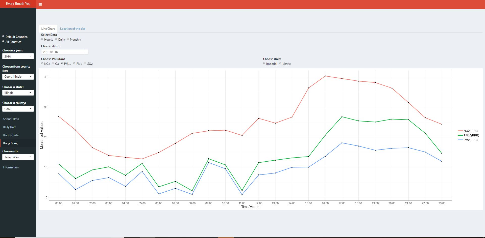
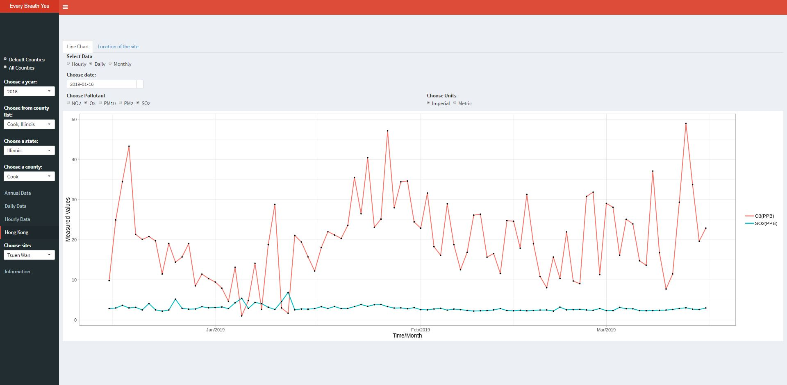

# Every Breath You Take
 An interactive visualization that analyses the air quality of different states and counties across United States.  
 
  
## **[Click here to view the visualization](http://shiny.evl.uic.edu:3838/g3/Every_Breath_You_Take/)**

**[Video Guide](https://www.youtube.com/watch?v=AlOXzHcn7Z4&feature=youtu.be)**
 
 
 ## Overview
 `I’m supposed to be in school, but instead I’m out here trying to make sure that my kids don’t grow up in a wasteland.` — Arielle Geismar, 17, An excerpt from The New York Times.
 
The above statement was stated by a teen student from Manhattan concerning the Climate Change. When many such youngsters took to the roads on March the sixteenth, concerned about their progeny at such a young age, we know that something is really not going the way it should. Today, Climate Change is an impending doom that we are facing collectively. It is not something that we can afford to be negligent or ignorant about.  

But, is it just a myth? Are we really doomed? Where's the proof? What do we do about it? WHAT DO WE KNOW ABOUT IT?  
  
The changes in climate and air quality are very gradual and hard to notice in the environment. In this project we tried studying the Air Quality data, by drawing meaningful patterns from it, by infering a sequence of events correlating a consequence which could serve as a forewarning to us, and help save the environment.  
  
We collected data regarding various attributes which correspond to the Air Quality such as Temperature, Levels of various Pollutants in the air such as Carbon Monoxide, Nitrous Oxide, Sulphur Dioxide, Ozone, etc. We have analysed the trends of the above stated components over the span of the last thirty years to establish a significant change in our ecosystem. We have toyed with the data from all angles and explored best visualization practices to effectively communicate this message across.  

The application analyses the Air Quality data for different states and counties across the US from 1990-2018. The Air Quality data has been categorized into Annual, Daily, Hourly data files. The application analyses the same data in multiple ways (Pie Chart, Bar Chart, Line Chart, HeatMap, Table) to derive insights from the changing trends over the years. Apart from analysing the Air Quality for the US, this application also analyses the Air Quality data for Hong Kong as well. We have experimented with different layouts considering user experience as well.


## Team
Sai Krishnan Thiruvarpu Neelakantan  
Praveen Chandrasekaran  
Varsha Jayaraman  
Abdullah Aleem  


## Setup

Softwares required:- **R** and **RStudio**  

Download and install R: https://cran.cnr.berkeley.edu/. (R (20178-12-20 Eggshell Igloo))  
Download ans install RStudio: https://www.rstudio.com/products/rstudio/download/. (R-Studio (1.1.463))

Libraries used:- **shiny, shinydashboard, ggplot2, lubridate, DT, grid, leaflet, scales, shinycssloaders, shinyWidget, tidyverse, tmap tmaptools, sf, splitstackshape, cdlTools, plotly**

To check currently installed libraries, type the following in R terminal  
```
installed.packages()[,1:2]
```
    
Libraries can be installed using the following command. Replace shiny with name of library you want to install.
```
install.packages(shiny)
```

## Data

The data was collected from the US EPA website.  

You can download all the Annual, Daily, Hourly data files from https://aqs.epa.gov/aqsweb/airdata/download_files.html  
The data files for Hong Kong can be downloaded from https://openaq.org/#/countries  
The data files for all Heatmaps can be downloaded from https://www.census.gov/geo/maps-data/data/cbf/cbf_counties.html  

This repository doesn't contain Daily, Hourly or Hong Kong data. There files were large and can be downloaded directly from the links above.


## Preprocessing

The data preprocessing for this application is done for Daily and Hourly Data of the United States. Apart from this preprocessing was done separately for Hong Kong data.  

In the daily data, all the daily files from 1990 to 2018 were loaded and only necessary columns were selected and removing the State.Code, County.Code, Defining.Site and Number.of.Sites.Reporting columns which are not used for this application. This preprocessing helped us reduce the daily files size from 650 MB (approx.) to 400 MB (approx.).  

Now, coming to the hourly data for 2018. We had 8 huge separate files for each pollutant, Wind and Temperature data. The first step of this data preprocessing is the extraction of dates with respect to the county from all the files so that we can develop the functionality to show the user which data is available for the selected County and date under hourly section. We extracted the date from 18 individual files and compiled into a single file.  

After this, for plotting purpose we had done some preprocessing since we cannot load such huge files into application directly. So we took each file separately and divided into 12 files based on the month. During this process, we removed the columns in the data which are not required for the application. Also, the values were converted into a single unit for a common scale. Then, we calculated the respective imperial units for the values (ppm to mg/m3).  

Then, for plotting the heat map we needed the data for the pollutants at a daily level. So we used the preprocessed file from the above step and used that to calculate the daily value of the pollutants by aggregating the hourly values given to a single value for that day. We made 12 separate files monthly vise for the map data.  

We had the hourly files for the Hong Kong data for 6 pollutants for 16 locations for the last 90 days. We made a separate file for the latitude and longitude files for the 16 locations. After that, we removed the columns not used in the application from the hourly data and saved that for the hourly plotting. Then for the daily and monthly plotting, we aggregated these hourly values to a daily and monthly format.  

For these preprocessed files we'll need to run the preprocessing code. Please follow the below folder structure while running the preprocess code.  
Raw Files/Daily --> Place the daily raw files for the US here
Raw Files/Monthly --> Place the Monthly files for the US here
Raw Files/Hong Kong --> Place the Individual pollutant file here  

Place the preprocess.R files one folder level above the Raw Files directory and the preprocessed files will be generated. **This may take up to 10 to 15 minutes**  

**TBD**: Setup a google drive where you can download the preprocessed data directly from.

## App

[Click here to view the final app.](http://shiny.evl.uic.edu:3838/g3/Every_Breath_You_Take/) This app was optimized to run on screen in [Electronic Visualization Lab at UIC](https://www.youtube.com/watch?v=4VdBnH9_47E) but also runs reasonably on desktop screen. **Please set your browser zoom level to ~50% for optimal experience.**

You can also compile and run it locally by running app.R in RStudio. Make sure you have followed all the instructions above to install all libraries and downloaded and preprocessed all the relevent data before running the app.

## Navigating

Once you click on the link, the application will consist of five tabs on the sidebar for navigation purposes. The detailed description of the tab functionalities are as follows.  

**Annual Data:**
Under Annual Tab, the application enables the user to choose a year from 1990 to 2018, then a State and County (either from the default list or from the list of all state/counties)
1. The user will be able to see the AQI Category days and Pollutant Data in Pie Chart, Bar Chart, and Table format.
2. The user will then be able to see the changing trends in pollutants and AQI values over the years from 1990 to 2018. The user has the option here to choose what pollutant/Type of AQI values to plot in the line graph.
3. Then, we have these data displayed in the format of a table in terms of percentage, the user can search for a particular year.
4. The application then displays the heat map for the pollutants, this heat map displays the relative badness of the selected pollutant across the US. The user can choose the pollutant from the options to see that pollutant's effect across the US. The user has the slider to choose to rank the number of relatively badly affected counties for that pollutant. For example, if the user sets the slider to 100, then the map shows the top 100 counties that are most affected by that selected pollutant. Apart from this, there are 3 inputs for the pollutant map and 3 for the aqi map. The first one ask which quantity you want to see the map for. The second inputs allows the user to switch between two beautiful color palettes (both of the color blind friendly). The third input asks to user to define the breaks he want to see for the data. There are two options for this 1) pretty (rounded equal intervals) and natural break (uses jenks method to define breaks). Using an interactive interface and such a level of control the user can interactively visualize the available data.
5. The same kind of heat map is given for the AQI values. The user can choose between Max AQI values, 90th Percentile, and Median AQI value for the selected year. The user also has the option to choose the color and breaks here as well.
6. The user will see a county map to show the location of that particular county in the United States.  

**Daily Data:**
Now under Daily Data tab,
1. The user will be able to see a stacked bar chart which shows the contribution of each AQI days in percentage for each month of the selected year.
2. Then, the user can see a line chart which shows the AQI value of each day in the selected year with a major pollutant of that day.
3. Also, the user will be able to see the table of the contribution of each AQI days for each month of the selected year.

**Hourly Data:**
This functionality is available only for the year 2018. The user can choose any date from the date picker given in the tab. Once the user chooses the data, the application loads the list of data available for that particular date chosen (Pollutants, Wind, and Temp). From the checkboxes, the user can select any number of plots that to be plotted in the line graph to compare the pollutants along with Wind and Temperature data. The user can also choose the units in which he can view the data.  

**Hong Kong:**
The data is available for the last 90 days for the country. The user can choose any of the dates from the data picker given. Once the user chooses a site(location), the available data for that date loads and the user can select from the checkboxes the pollutants which are to be plotted. The daily and monthly data is also plotted in the line graph for Hong Kong. Also, the user will be able to see the location of the Site chosen in a Leaflet map.  

**About:**
This tab contains information about the coursework, who developed the project, what libraries are being used to visualize the data and the data source from which the data is downloaded. This section also contains some information about the description of the application and the purpose of doing this project.


## Snapshots 







